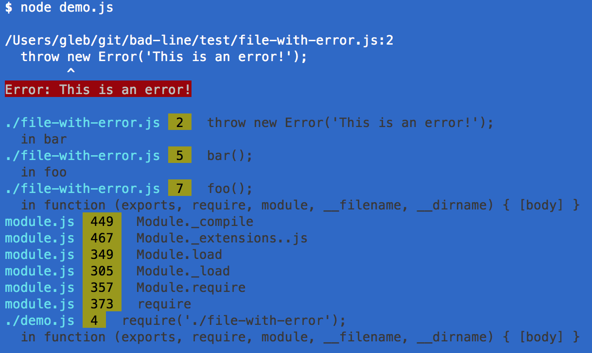
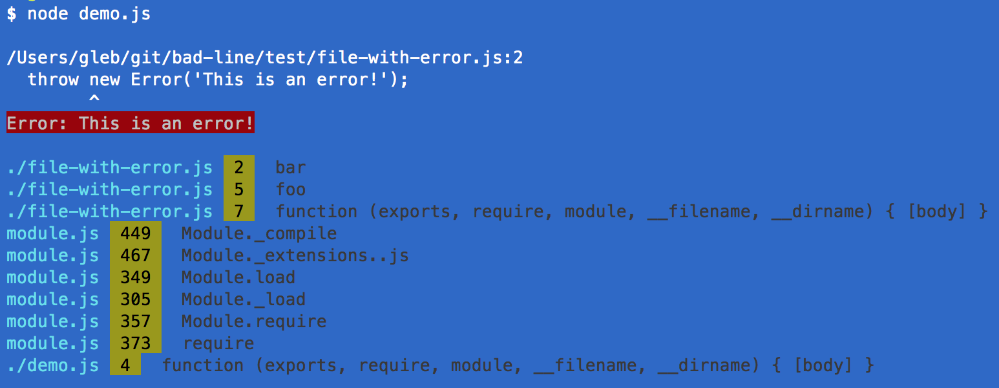

# bad-line

> Plugin for [cute-stack][cute-stack] that prints bad line for local source files

[![NPM info][nodei.co]](https://npmjs.org/package/bad-line)

[![Build status][ci-image]][ci-url]
[![dependencies][dependencies-image]][dependencies-url]
[![devdependencies][bad-line-devdependencies-image] ][bad-line-devdependencies-url]

## Install and use

    npm install --save bad-line

Include as a plugin for [cute-stack][cute-stack]

```js
require('cute-stack')(require('bad-line'));
```

or do it in several steps

```js
var cute = require('cute-stack');
cute.ui.badLine = require('bad-line');
cute('badLine');
```

## Example

Let us initialize `cute-stack` in one file and then execute a file with an exception.
You can see these files in the folder `test`

```js
// demo.js
var cute = require('cute-stack');
cute.ui.badLine = require('bad-line');
cute('badLine');
require('./file-with-error');
// file-with-error.js
function bar() {
  throw new Error('This is an error!');
}
function foo() {
  bar();
}
foo();
```

This generates the following output, notice the actual source line contents



Compare this with standard output produced by `pretty` formatter for example



`bad-line` prints the actual offending line, not just the function's name.

## Small print

Author: Gleb Bahmutov &copy; 2015
[@bahmutov](https://twitter.com/bahmutov) [glebbahmutov.com](http://glebbahmutov.com)

License: MIT - do anything with the code, but don't blame me if it does not work.

Spread the word: tweet, star on github, etc.

Support: if you find any problems with this module, email / tweet / open issue on Github

[ci-image]: https://travis-ci.org/bahmutov/bad-line.png?branch=master
[ci-url]: https://travis-ci.org/bahmutov/bad-line
[nodei.co]: https://nodei.co/npm/bad-line.png?downloads=true
[dependencies-image]: https://david-dm.org/bahmutov/bad-line.png
[dependencies-url]: https://david-dm.org/bahmutov/bad-line
[bad-line-devdependencies-image]: https://david-dm.org/bahmutov/bad-line/dev-status.png
[bad-line-devdependencies-url]: https://david-dm.org/bahmutov/bad-line#info=devDependencies

[cute-stack]: https://github.com/davidmarkclements/cute-stack
